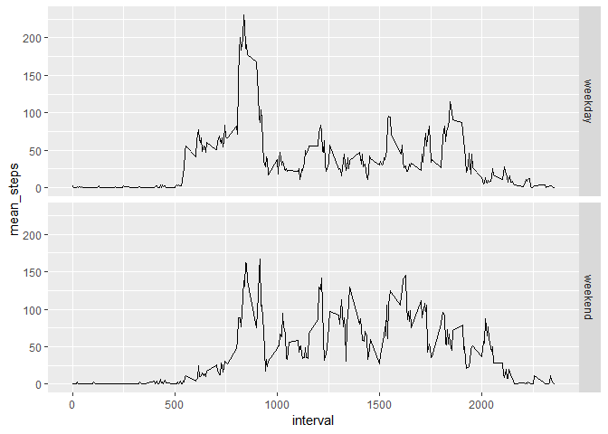

## Loading and preprocessing the data

```r
Sys.setlocale(locale="English")
```

```
## [1] "LC_COLLATE=English_United States.1252;LC_CTYPE=English_United States.1252;LC_MONETARY=English_United States.1252;LC_NUMERIC=C;LC_TIME=English_United States.1252"
```

```r
library(data.table)
library(ggplot2)
library(magrittr)
library(knitr)
activity=read.csv("./input/activity.csv") %>% setDT
summary(activity)
```

```
##      steps                date          interval     
##  Min.   :  0.00   2012-10-01:  288   Min.   :   0.0  
##  1st Qu.:  0.00   2012-10-02:  288   1st Qu.: 588.8  
##  Median :  0.00   2012-10-03:  288   Median :1177.5  
##  Mean   : 37.38   2012-10-04:  288   Mean   :1177.5  
##  3rd Qu.: 12.00   2012-10-05:  288   3rd Qu.:1766.2  
##  Max.   :806.00   2012-10-06:  288   Max.   :2355.0  
##  NA's   :2304     (Other)   :15840
```

```r
#remove na
#activity=activity[!is.na(steps)]
```


## What is mean total number of steps taken per day?

```r
#sum transformation
activityPerDay=activity[!is.na(steps),.("steps_per_day"=sum(steps,na.rm = T))
                        ,by=date]
#histogram
ggplot(data=activityPerDay)+geom_histogram(aes(steps_per_day))
```

```
## `stat_bin()` using `bins = 30`. Pick better value with `binwidth`.
```

<!-- -->

```r
#summary
out1=activityPerDay[,.("means"=mean(steps_per_day,na.rm = T),
                      "medians"=median(steps_per_day,na.rm = T)
)]
out1
```

```
##       means medians
## 1: 10766.19   10765
```


## What is the average daily activity pattern?

```r
activityPerInterval=activity[,.("mean_steps"=mean(steps,na.rm = T)),by=interval]
ggplot(data=activityPerInterval)+geom_line(aes(x=interval,y=mean_steps))
```

<!-- -->

```r
activityPerInterval[mean_steps==max(mean_steps),interval]
```

```
## [1] 835
```


## Imputing missing values

```r
#number of missing cases
activity[is.na(steps),.N]
```

```
## [1] 2304
```

```r
# changing NAs to means by interval
activity_fill=activityPerInterval[activity,on=c("interval")]
#lets have them as integers also
activity_fill[is.na(steps),steps:=round(mean_steps) %>% as.integer()]

#sum transformation
activityFillPerDay=activity_fill[!is.na(steps),
                               .("steps_per_day"=sum(steps,na.rm = T))
                               ,by=date]
#histogram
ggplot(data=activityFillPerDay)+geom_histogram(aes(steps_per_day))
```

```
## `stat_bin()` using `bins = 30`. Pick better value with `binwidth`.
```

<!-- -->

```r
#summary
out2=activityFillPerDay[,.("means"=mean(steps_per_day,na.rm = T),
                          "medians"=median(steps_per_day,na.rm = T)
)]
out2
```

```
##       means medians
## 1: 10765.64   10762
```

```r
#mean and median decreased
```
After filling missing values estimations of mean and median for total steps per day dropped insignificantly (lesser than 0.05%):

```r
(out2/out1-1)*100
```

```
##           means     medians
## 1: -0.005102409 -0.02786809
```


## Are there differences in activity patterns between weekdays and weekends?

```r
activity_fill[,weekend:=ifelse(date %>% strftime("%w") %in% c(0,6),"weekend","weekday") 
                        %>% factor]

activityPerIntervalWknd=activity_fill[,.("mean_steps"=mean(steps,na.rm = T)),by=.(weekend,interval)]

ggplot(data=activityPerIntervalWknd,aes(x=interval,y=mean_steps) ) + geom_line() +
  facet_grid(weekend~.)
```

<!-- -->


